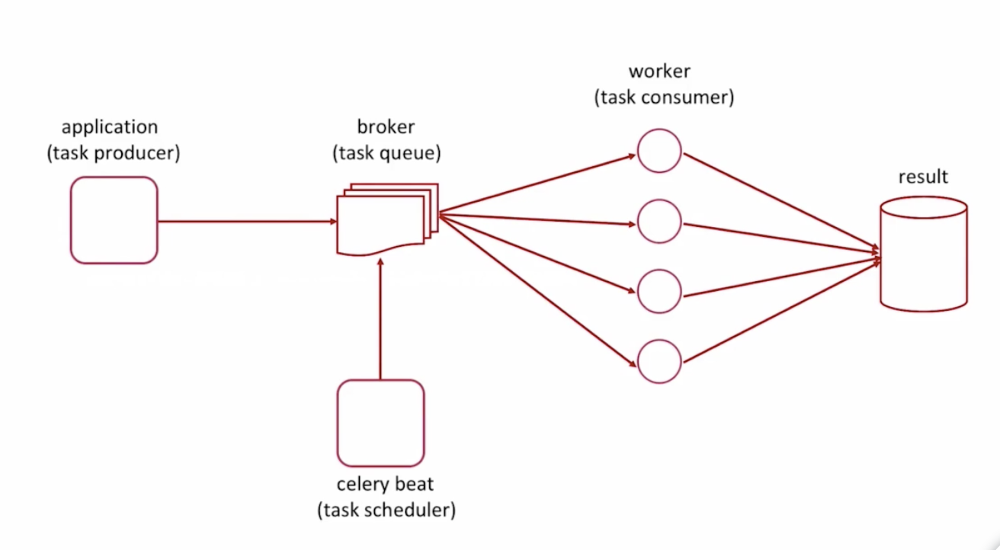

### Pyenv

Pyenv 中修改这个路径下的对应版本的文件，为制定版本加速https://www.cnblogs.com/ajianbeyourself/p/11305265.html

`/usr/local/Cellar/pyenv/1.2.18/plugins/python-build/share/python-build`

将原来的

```
https://www.python.org/ftp
```

替换为

```
http://mirrors.sohu.com
```

然后再执行下载命令

创建一个虚拟环境

pyenv virtualenv 3.7.6 env4first

查看所有虚拟环境

pyenv virtualenvs

激活一个虚拟环境

pyenv activate env4first


https://www.cnblogs.com/louyefeng/p/12031272.html


### virtualenv

进入，列出虚拟环境

workon

推出环境

Deactivate

删除环境

rmvirtualenv xxxx

创建环境

mkvirtualenv xxxx

### pipenv

进入虚拟piping shell

退出 exit

pipenv --python 3.5 指定某一python版本创建环境

pipenv install  使用当前系统的python3创建环境

pipenv shell 激活虚拟环境

pipenv --where 显示目录信息 即路径 

pipenv --venv 显示虚拟环境的信息 

 

pipenv --py 显示Python解释器信息 

使用pycharm  输入 Project Interpreter的解释器地址 就可以用该解释器信息 

 

pipenv graph 查看目前安装的库和依赖包

 

安装相关模块 

比如 :

　　pipenv install requests 

　　pipenv install django==1.11 安装固定版本的

 

卸载

pipenv uninstall --all 卸载全部包

pipenv uninstall django 卸载django