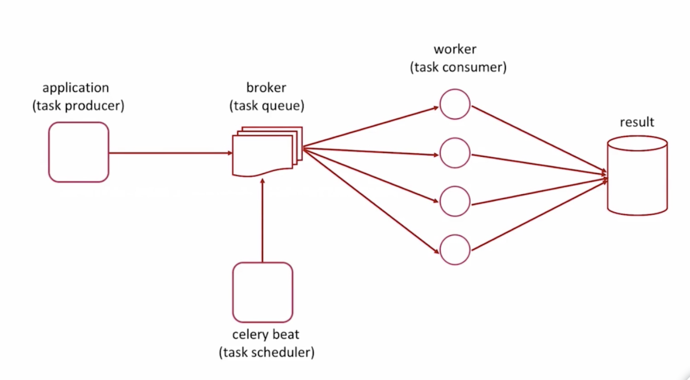

Pyenv 中修改这个路径下的对应版本的文件，为制定版本加速https://www.cnblogs.com/ajianbeyourself/p/11305265.html

`/usr/local/Cellar/pyenv/1.2.18/plugins/python-build/share/python-build`

将原来的

```
https://www.python.org/ftp
```

替换为

```
http://mirrors.sohu.com
```

然后再执行下载命令

创建一个虚拟环境

pyenv virtualenv 3.7.6 env4first

查看所有虚拟环境

pyenv virtualenvs

激活一个虚拟环境

pyenv activate env4first